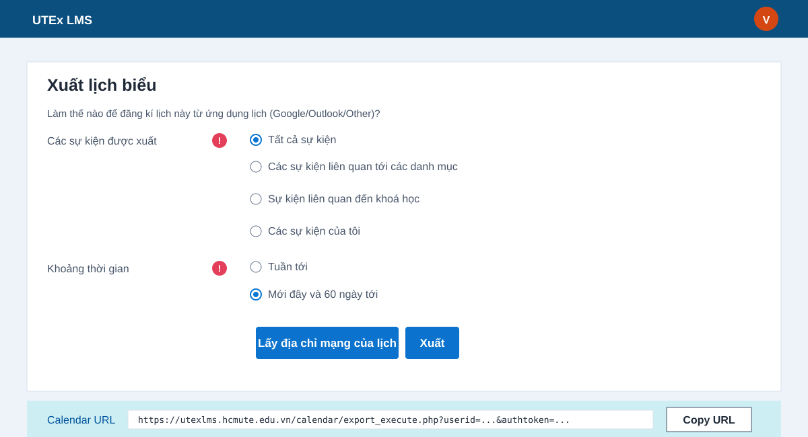

# UTE Notice

Ứng dụng Android giúp sinh viên HCMUTE theo dõi lịch kiểm tra, deadline bài nộp, quiz/test trên Moodle UTEx LMS và nhận thông báo trước khi tới hạn.

Repo GitHub/hướng dẫn: [vanity1412/notice-app-utex](https://github.com/vanity1412/notice-app-utex)

Liên hệ hỗ trợ khi gặp sự cố: **Vũ Văn Thông - 0968046024**

<p align="center">
  
</p>

## App Có Gì?

- Lưu Calendar URL/iCal URL của Moodle trong máy.
- Kiểm tra Calendar URL trước khi lưu, báo lỗi rõ nếu dán nhầm link hoặc thiếu token.
- Có nút dán nhanh từ clipboard, xóa kết nối Moodle và che `authtoken` sau khi lưu.
- Tự đồng bộ lịch nền khoảng 5 phút/lần khi có mạng.
- Hiển thị deadline sắp tới dạng thẻ dễ nhìn, có thể đổi sang chế độ lịch tháng.
- Có ô tìm kiếm, lọc theo bài nộp/kiểm tra/thi và ẩn/hiện deadline đã đánh dấu xong.
- Phân loại nhanh: bài nộp, kiểm tra, thi, deadline.
- Mỗi deadline có nút mở Moodle, copy thông tin và đánh dấu đã xong.
- Thông báo khi phát hiện deadline mới.
- Nhắc trước hạn mặc định: 1 ngày, 12 giờ, 1 giờ; có thể bật thêm 2 ngày, 3 giờ, 30 phút hoặc bỏ bớt mốc.
- Có thông báo tổng hợp hằng ngày, mặc định 1 lần/ngày lúc 6:00.
- Thông báo tổng hợp chỉ tự bật sau khi đã kết nối và sync Moodle thành công.
- Deadline mới, deadline thay đổi và nhắc trước hạn có âm thanh + rung; thông báo tổng hợp hằng ngày không âm thanh.
- Có thể chọn giờ/phút và ngày trong tuần để nhận thông báo tổng hợp.
- Có nút gửi thông báo test và mở cài đặt pin để tránh Android chặn chạy nền.
- Không lưu mật khẩu Moodle.
- Không dùng `MoodleSession`/cookie trong app.
- Calendar URL được lưu bằng EncryptedSharedPreferences khi thiết bị hỗ trợ Android Keystore.

## Cách Lấy Calendar URL Từ Moodle UTEx

Truy cập trang xuất lịch:

```text
https://utexlms.hcmute.edu.vn/calendar/export.php?
```

Nếu Moodle yêu cầu đăng nhập, hãy đăng nhập bằng tài khoản trường/Google như bình thường.



Sau đó làm theo các bước:

1. Ở mục **Các sự kiện được xuất**, chọn lịch bạn muốn app thông báo.
   Khuyến nghị chọn **Tất cả sự kiện** để lấy đủ deadline, quiz, lịch kiểm tra.
2. Ở mục **Khoảng thời gian**, chọn khoảng thời gian muốn theo dõi.
   Khuyến nghị chọn **Mới đây và 60 ngày tới**.
3. Bấm **Lấy địa chỉ mạng của lịch**.
4. Ở khung **Calendar URL**, bấm **Copy URL**.
5. Mở app **UTE Notice**.
6. Dán URL vừa copy vào ô kết nối lịch Moodle.
7. Bấm **Lưu & đồng bộ**.

Trong app cũng có mục **Hướng dẫn nhanh** để mở thẳng trang export lịch Moodle hoặc mở repo GitHub này khi cần xem lại hướng dẫn.

Trong tab **Hướng dẫn**, app hiển thị sẵn link:

```text
https://utexlms.hcmute.edu.vn/calendar/export.php?
```

Bạn có thể bấm **Copy** để copy link này. Nếu chưa vào được trang xuất lịch, hãy mở web trường/Moodle trước để có quyền truy cập.

URL đúng thường có dạng:

```text
https://utexlms.hcmute.edu.vn/calendar/export_execute.php?userid=...&authtoken=...&preset_what=...&preset_time=...
```

## Cách Dùng App

1. Cài file `UTE-Notice.apk` trên điện thoại Android.
2. Mở app **UTE Notice**.
3. Cấp quyền thông báo nếu Android hỏi.
4. Dán Calendar URL đã copy từ Moodle, hoặc bấm **Dán clipboard**.
5. Bấm **Lưu & đồng bộ**.
6. App sẽ hiển thị lịch sắp tới và tự nhắc khi có deadline mới hoặc gần tới hạn.
7. Dùng ô tìm kiếm hoặc bộ lọc để xem nhanh bài nộp/kiểm tra/thi.
8. Bấm **Xong** trên deadline đã hoàn thành để ẩn khỏi danh sách và không nhắc lại mục đó.

## Cài Đặt Thông Báo

- Mặc định app gửi thông báo tổng hợp **mỗi ngày 1 lần lúc 6:00**.
- Trước khi bạn kết nối Moodle thành công, thông báo tổng hợp đang tắt để tránh báo rỗng.
- Trong app, vào tab **Hướng dẫn** -> **Cài đặt thông báo**.
- Bấm **Chọn giờ** để đặt giờ/phút cụ thể.
- Bấm các nút **T2, T3, T4, T5, T6, T7, CN** để chọn ngày nhận thông báo.
- Bấm **Mỗi ngày** để bật đủ cả tuần, hoặc **Tắt** để tắt thông báo tổng hợp.
- Các nhắc trước hạn riêng lẻ mặc định bật: 1 ngày, 12 giờ và 1 giờ trước deadline.
- Có thể bật/tắt từng mốc nhắc trước hạn trong app; app luôn giữ ít nhất 1 mốc nhắc.
- Bấm **Gửi test** để kiểm tra điện thoại có nhận thông báo không.
- Bấm **Cài đặt pin** và cho phép app chạy nền nếu máy hay tự tắt ứng dụng.
- Nếu không nhận được thông báo, kiểm tra quyền thông báo của Android cho app **UTE Notice**.

## Bảo Mật

- Calendar URL có `authtoken`, ai có URL này có thể xem lịch Moodle của bạn.
- Không đưa Calendar URL lên GitHub, Facebook, ảnh chụp công khai hoặc nhóm chat.
- Nếu lỡ lộ URL, hãy vào Moodle tạo lại link export mới.
- App chỉ lưu URL trong bộ nhớ local của điện thoại.
- App không lưu mật khẩu, không lưu Google token, không lưu cookie đăng nhập Moodle.

## Build APK Bằng GitHub Actions

1. Upload toàn bộ project lên GitHub.
2. Vào tab **Actions**.
3. Chọn workflow **Build Android APK**.
4. Bấm **Run workflow**.
5. Workflow sẽ chạy unit test parser iCal trước khi build APK.
6. Khi chạy xong, tải artifact `UTE-Notice-apk`.
7. Giải nén artifact để lấy `UTE-Notice.apk`.

## Build iOS Bằng GitHub Actions

Workflow **Build iOS App** nằm ở `.github/workflows/build-ios.yml`.

- Khi push lên `main`/`master`, workflow sẽ build app iOS trong `ios-local/` và upload artifact `UTE-Notice-ios`.
- Mặc định workflow tạo bản unsigned để kiểm tra build.
- Muốn tạo `.ipa` cài được trên iPhone thật, cần cấu hình Apple signing secrets như hướng dẫn trong `docs/BUILD_IOS_GITHUB.md`.
- iOS không cho app local-only sync nền chính xác mỗi 5 phút như Android; app dùng `BGAppRefreshTask` theo cơ chế best-effort của iOS.

## Mở Code Bằng Android Studio

1. Cài Android Studio.
2. Mở thư mục:

```text
android/
```

3. Bấm **Sync Gradle**.
4. Bấm **Run** để chạy trên máy Android hoặc emulator.

## File Chính

```text
android/app/src/main/java/com/utex/deadline/MainActivity.kt       # Màn hình chính
android/app/src/main/java/com/utex/deadline/IcsParser.kt          # Parse lịch iCal
android/app/src/main/java/com/utex/deadline/DeadlineSync.kt       # Tải lịch và phát hiện deadline mới
android/app/src/main/java/com/utex/deadline/SyncWorker.kt         # Tự sync nền
android/app/src/main/java/com/utex/deadline/ReminderWorker.kt     # Nhắc trước hạn
android/app/src/main/java/com/utex/deadline/ReminderScheduler.kt  # Lên lịch sync và nhắc
android/app/src/test/java/com/utex/deadline/IcsParserTest.kt      # Test parse file iCal Moodle
```
